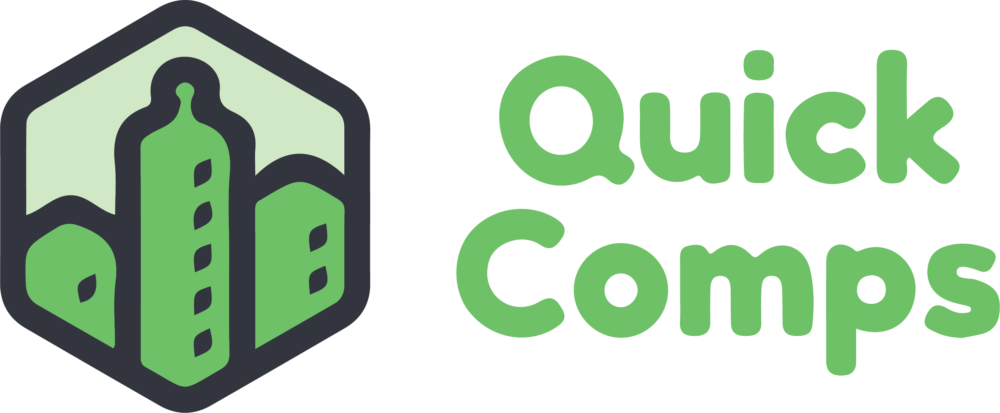
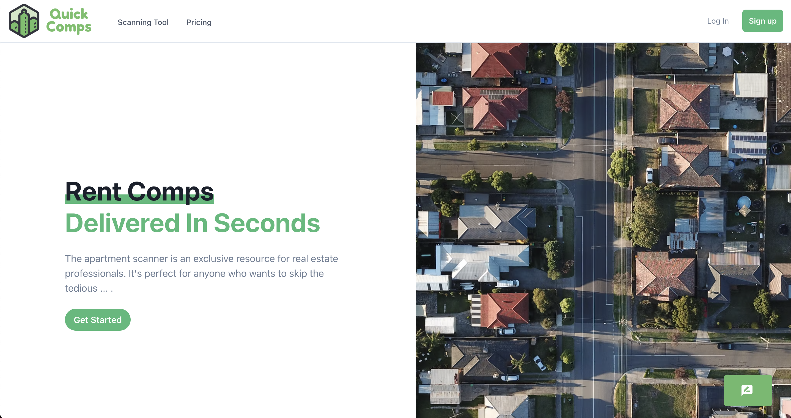
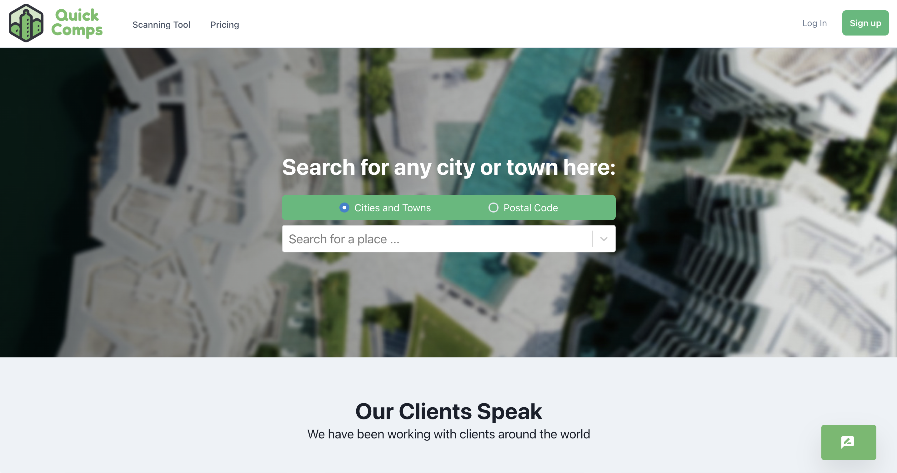

<div id="top"></div>
<!--
*** Thanks for checking out the Best-README-Template. If you have a suggestion
*** that would make this better, please fork the repo and create a pull request
*** or simply open an issue with the tag "enhancement".
*** Don't forget to give the project a star!
*** Thanks again! Now go create something AMAZING! :D
-->


<!-- PROJECT SHIELDS -->
<!--
*** I'm using markdown "reference style" links for readability.
*** Reference links are enclosed in brackets [ ] instead of parentheses ( ).
*** See the bottom of this document for the declaration of the reference variables
*** for contributors-url, forks-url, etc. This is an optional, concise syntax you may use.
*** https://www.markdownguide.org/basic-syntax/#reference-style-links
-->


<!-- PROJECT LOGO -->
<br />
<div align="center">
  <a href="https://github.com/gcohen1928/Quick-Comps">
    
  </a>

  <h3 align="center">Welcome to Quick Comps!</h3>

  <p align="center">
    Our beta is now live! Click the link below to get free access to our tool.
    <br />
    <br />
    <br />
    https://quickcomps.us
  </p>
</div>


<!-- TABLE OF CONTENTS -->
<details>
  <summary>Table of Contents</summary>
  <ol>
    <li>
      <a href="#about-the-project">About The Project</a>
      <ul>
        <li><a href="#built-with">Built With</a></li>
      </ul>
    </li>
    <li>
      <a href="#getting-started">Getting Started</a>
      <ul>
        <li><a href="#installation">Installation</a></li>
      </ul>
    </li>
  </ol>
</details>


<!-- ABOUT THE PROJECT -->
## About The Project

<p float="center">


</p>


<br />
<br />                                                                              

This React app is a tool designed to help real estate professionals automate their tedious rental research process. It saves countless hours of searching through apartments for rent online and allows real estate professionals to thrive.

Here's why:
* It generates comp sets for any given city in the United States within a few seconds.
* We're currently in beta, so it's completely free to use 


<p align="right">(<a href="#top">back to top</a>)</p>


### Built With

* [React.js](https://reactjs.org/)
* [Chakra UI](https://chakra-ui.com/)
* [Node.js](https://nodejs.org/)
* [AWS](https://aws.amazon.com/)                                

<p align="right">(<a href="#top">back to top</a>)</p>


<!-- GETTING STARTED -->
## Getting Started


### Installation


1. Clone the repo
   ```sh
   git clone https://github.com/your_username_/Project-Name.git
   ```
2. Install NPM packages
   ```sh
   npm install
   ```
   
   Navigate to Apartments-web AND Apartments-server directories and install dependencies for both following 
  
3. Run server
   ```sh
   node api-main.js
   ```
4. Run website
   ```sh
   yarn start
   ```


<p align="right">(<a href="#top">back to top</a>)</p>


<!-- ROADMAP -->
## Roadmap

- [x] Add full authentication
- [ ] Add user dashboard
- [ ] Record user queries
- [ ] Add payment and protect routes

See the [open issues](https://github.com/gcohen1928/Quick-Comps/issues) for a full list of proposed features (and known issues).

<p align="right">(<a href="#top">back to top</a>)</p>

